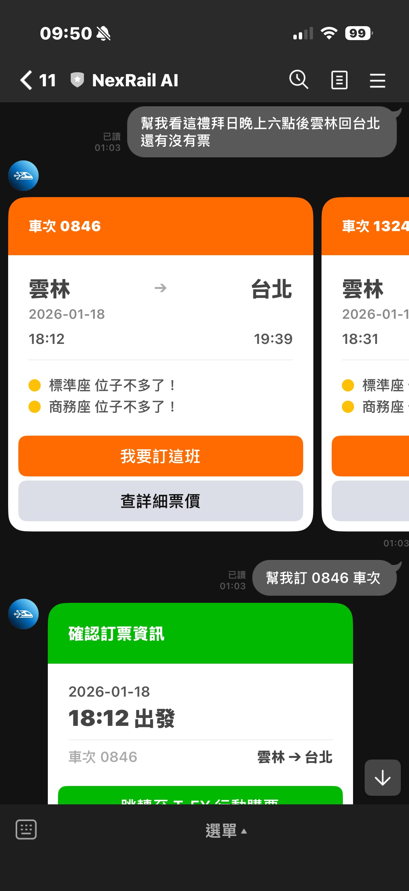
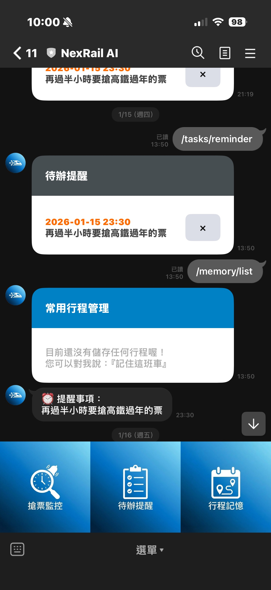
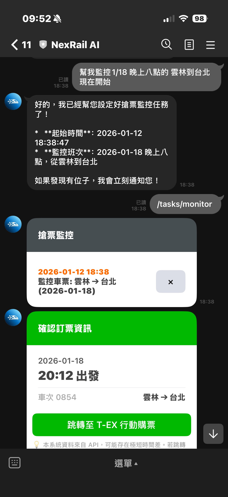
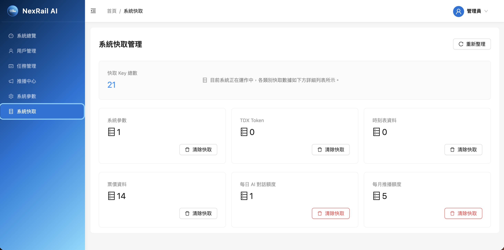

# NexRailAI

[](https://line.me/R/ti/p/@539axasf)

NexRailAI 是一個結合 LLM 語意理解與分散式架構的高鐵訂票助理，直接整合在每個人日常最熟悉的 **LINE** 中。

## 專案概述

### 解決的問題

現有的高鐵購票方式往往伴隨著以下痛點：
- **指令僵化**：傳統 Chatbot 只能依賴關鍵字，無法理解模糊的時間或地點描述。
- **流程繁瑣**：官方 App 或網站需多次點擊與輸入，操作路徑長。
- **錯過搶票**：熱門時段或連續假期容易忘記搶票時間，導致一票難求。
- **重複輸入**：每次幫親友訂票都要重新設定起訖站與時間，缺乏記憶功能。

### 解決方案

NexRailAI 提供最自然的對話式訂票體驗：

1. **自然語言互動**: 利用 Google Gemini 的 Function Calling 能力，精準將自然語言轉換為結構化 API 請求。就像跟朋友聊天一樣，一句話完成查票。
2. **分散式搶票監控**: 在背景自動掃描釋出座位，無需開著視窗等待，一有票立即通知。
3. **智慧記憶**: AI 具備長期記憶能力，能記住「回家」、「出差」等常用行程，下次查票自動帶入偏好。
4. **個人化提醒**: 整合 LINE 推播功能，可設定任意時間的提醒事項，不再錯過搶票黃金時機。

## 技術架構與決策 (Architecture & Decisions)

這是在開發過程中針對不同場景所做的技術選擇與權衡：

### 1. 多實例並發控制 (Distributed Locking)
為了高可用性 (HA)，系統設計支援多實例部署。但這導致排程任務 (Scheduled Tasks) 在每台機器上同時觸發，造成重複刷票和重複推播。

*   **決策**：放棄效能較差的資料庫鎖，選擇 Redis 分散式鎖。
*   **實作細節**：
  *   導入 **Redisson** 框架，取代自行維護 Lua Script 的高成本。
  *   啟用 **Watchdog 機制**：考量到外部 API 可能延遲導致任務執行時間超過鎖的 TTL，Watchdog 會每 10 秒自動續約，確保任務執行期間鎖不會意外釋放，徹底解決 Race Condition。

### 2. 解決排程任務的隊頭阻塞 (Head-of-Line Blocking)
為了避免耗時的監控任務阻塞輕量的提醒任務，我利用 **Java 21 Virtual Threads (Project Loom)** 取代傳統的執行緒池。

*   **實作**：使用 `Executors.newVirtualThreadPerTaskExecutor()` 為每個排程任務分配獨立的虛擬執行緒，實現高吞吐量並行處理。
*   **保護機制**：引入 `Semaphore` 限制最大併發數（20），保護下游 TDX API 不被瞬間流量擊垮。
*   **結構化並發**：利用 `try-with-resources` 確保主執行緒等待所有虛擬執行緒完成後才釋放分散式鎖，保證數據一致性。

### 3. LLM 的精準控制
為了避免大型語言模型產生幻覺，系統並非讓 LLM 直接生成回覆，而是將其定位為 **語意路由器 (Semantic Router)**。利用 **Spring AI Function Calling** 將自然語言轉換為嚴格定義的 JSON 參數，再由後端程式碼呼叫 TDX API，確保票務資訊的絕對正確性。

### 4. 整合測試策略
為了驗證 Watchdog 自動續約機制，單純的單元測試無法模擬真實 Redis 的過期與續約行為。因此引入 **Testcontainers**，在測試階段動態啟動真實 Redis 容器，進行端對端的並發控制測試，確保鎖機制在生產環境可靠。

## 實機畫面 (Screenshots)

### 手機端體驗 (Mobile Experience)

| 自然語言訂票 | 待辦提醒與常用行程 | 監控通知與卡片 |
|:---:|:---:|:---:|
|  |  |  |
| 支援模糊時間與地點解析，直接喚起訂票 | 設定個人化提醒與記憶常用班次 | 背景自動掃描釋出座位，即時推播通知 |

### 後台管理系統 (Admin Dashboard)



> 視覺化監控系統狀態、任務管理、使用者管理與全站參數熱更新。

## 立即體驗 (Live Demo)

歡迎掃描下方 QR Code 加入 LINE 官方帳號，體驗 NexRailAI 的功能：


> 若無法掃描，請搜尋 LINE ID: @539axasf

## 核心功能 (Core Features)

NexRailAI 將複雜的高鐵訂票流程簡化為直覺的對話體驗：

*   **自然語言查票 (AI-Powered Search)**
    
    拋棄僵化的指令。你可以直接說：幫我查本週五晚上七點後回台南的票。AI 能精準解析模糊的時間概念與起訖地點，直接喚起訂票介面。

*   **智慧搶票監控 (Smart Monitoring)**
    
    熱門時段買不到票？只需告訴 AI：幫我監控這班車。系統便會在背景持續掃描釋出座位。一旦有人退票，系統將立即發送 LINE 通知。

*   **智慧記憶與常用班次 (Smart Memory)**
    
    AI 具備長期記憶能力。你可以設定如：這是我女兒的班次，幫我記下來。下次只需說：幫我查女兒的班次，系統即可自動帶入對應的起訖站與時間偏好。

*   **個人化提醒 (Custom Reminders)**
    
    隨身的 LINE 備忘錄。你可以設定任意時間的提醒事項，例如：明天早上 10 點提醒我搶連假車票。系統將準時透過 LINE 推播通知。

*   **圖文選單與快速存取 (Rich Menu)**
    
    提供直覺的 Rich Menu 介面，讓使用者能一鍵查詢當前的監控任務與待辦提醒，快速掌握所有背景任務狀態。

*   **視覺化票務卡片 (Rich UI)**
    
    所有查詢結果皆以 LINE Flex Message 呈現。清楚的發車時間、行駛時長與剩餘座位狀態，點擊卡片即可直達官方購票頁面。

*   **系統管理與控管 (System Management)**
    
    具備完善的配額管理機制，針對每位使用者的每日 AI 對話次數與每月提醒設定次數進行流量控制 (Rate Limiting)，並提供管理員後台進行全站廣播與系統參數調整。

## 開發挑戰與解決 (Challenges & Solutions)

在整合 LLM 的過程中，主要的挑戰在於將不可控的 AI 轉變為可控的系統組件：

### 1. 參數注入的命名陷阱 (DTO Consistency)
*   **問題**：在開發初期，發現 LLM 總是能正確填入抵達站，卻無法填入起始站，即使多次調整 Prompt 也無效。
*   **排查**：分析 Log 後發現，查詢車次的 DTO 使用 `from`/`to`，而查詢票價使用 `fromStation`/`toStation`。這種欄位命名不一致增加了 LLM 的認知負載，導致 Function Calling 失敗。
*   **解決**：重構所有相關 DTO，統一全域命名規範。這證實了對 LLM 而言，API 介面的語意一致性比 Prompt Engineering 更關鍵。

### 2. 克服記憶幻覺與權重管理
*   **問題**：當使用者詢問查詢額度時，LLM 傾向從 ChatMemory (歷史對話) 中編造一個數字，而非呼叫即時查詢工具。
*   **解決**：採取權重注入 (Weight Injection) 策略。在 System Prompt 中明確定義針對狀態類問題，即時工具查詢的權重高於歷史記憶 (Critical)。同時在後台保留清除記憶的 API 作為最終糾錯手段。

### 3. 馴服 LLM 的客套回應
*   **問題**：LLM 經常回覆「好的，馬上為您查詢」後就結束了 HTTP 請求，忘記呼叫對應的工具。
*   **解決**：這是 Completion 與 Function Calling 模式的衝突。透過降低 Temperature ，並在 System Prompt 強制約束其為路由組件而非客服，禁止在匹配工具時回覆純文字，成功解決此問題。

## 系統架構 (Architecture)

### 整體架構

```text
+----------------+      +------------------+      +-------------------+
|   LINE User    | ---> |   NexRailAI Bot  | ---> |   Google Gemini   |
| (Flex Message) | <--- |   (Spring Boot)  | <--- | (Function Calling)|
+----------------+      +--------+---------+      +-------------------+
                                 |
        [Distributed Lock]       | (1) Search & Cache
        (Redisson + Redis)       v
        +----------------+-----------------+
        |                |                 |
   +----+-----+    +-----+------+    +-----+------+
   | TDX API  |    | PostgreSQL |    | Redis Cache|
   | ( Thsr ) |    | (Schedule) |    | (Lock/Session)|
   +----------+    +------------+    +------------+
```

### 分散式鎖運作流程

```text
[Instance A]      [Instance B]       [Redis (Redisson)]
     |                 |                     |
     |---Try Lock----->|                     |
     |                 |----Try Lock-------->| (Locked by A)
     | (Acquired)      |                     |
     |                 |x (Skip Execution)   |
     |=== Run Task === |                     |
     | (Watchdog Auto-Renew 10s)             |
     |                 |                     |
     |<--Unlock--------|                     |
```

## 測試策略

本專案採用 **AI 自動化測試工作流**。利用自建的測試工作流技能，自動針對已實作的功能生成邊界案例與整合測試，確保核心邏輯與併發行為的穩健性。

*   **測試統計**：18 個測試類別，超過 100 個測試案例，核心業務邏輯覆蓋率達 95%。
*   **單元測試**：使用 JUnit 5 與 Mockito 驗證 Service 層邏輯。
*   **整合測試**：
  *   **ThsrSearchIntegrationTest**：驗證從使用者訊息、AI 解析到 Flex Message 回覆的完整流程。
  *   **DistributedLockIntegrationTest**：使用 Testcontainers 啟動真實 Redis，驗證多執行緒下的鎖競爭與 Watchdog 行為。

## 使用技術 (Built With)

*   **Core**: Java 21, Spring Boot 3.5.9
*   **AI**: Spring AI, Google Gemini 2.5 Flash
*   **Infrastructure**: PostgreSQL, Redis, Docker
*   **Deployment**: Zeabur (PaaS) - Serverless Environment
*   **Testing**: JUnit 5, Mockito, Testcontainers
*   **Messaging**: LINE Bot SDK (Flex Message)

## 快速開始

### 前置需求
*   Java 21 SDK
*   Docker & Docker Compose
*   Google Cloud Project (Gemini API Key)
*   TDX 帳號 (Client ID & Secret)

### 執行步驟

1.  **啟動基礎設施**
    ```bash
    docker-compose up -d
    ```

2.  **設定環境變數**
    請參考 `application.yml` 設定 `GEMINI_API_KEY`, `LINE_BOT_TOKEN`, `TDX_CLIENT_ID` 等參數。

3.  **執行應用**
    ```bash
    ./mvnw spring-boot:run
    ```

4.  **執行測試**
    ```bash
    ./mvnw test
    ```
